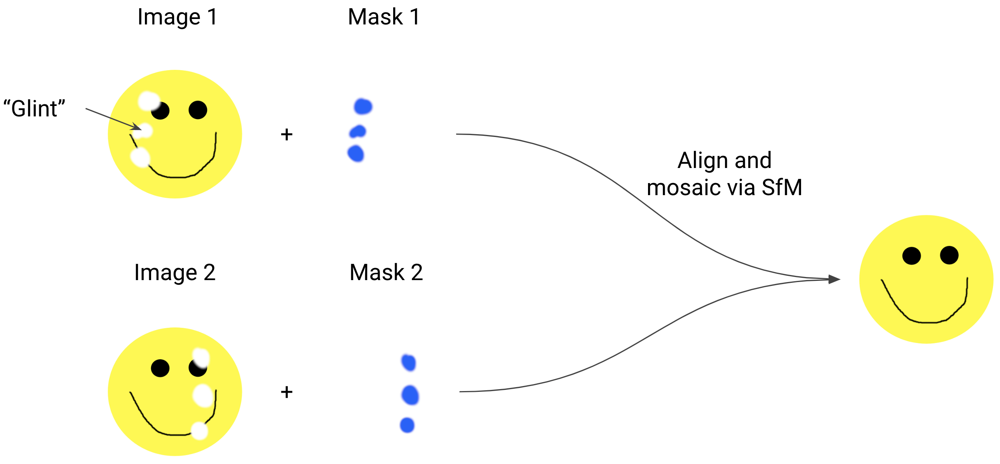

# Glint Mask Generator

Glint Mask Generator is a utility for generating mask images that correspond to the area of spectral glint in some
source imagery. Once generated, the masks can used by 3rd party structure-from-motion (SfM) software to replace glint
areas with data from overlapping imagery that are not glinty.

    

## Features

* Support for single and multi-file sensors.
    * RGB, PhaseOne 4-band CIRs, MicaSense RedEdge, and Phantom 4 MS images currently supported.
* Pixel buffering around glint areas.
* Parallel processing.

## How it works

Structure from Motion (SfM) photogrammetry offers an effective solution for handling masked or obscured areas in imagery
through its multi-image processing capabilities. As illustrated in the diagram, when two overlapping images contain
masks identifying problematic areas (such as glints or data gaps), SfM can leverage the complementary information from
both images during the alignment and mosaicking process. Where Image 1 contains masked regions, corresponding areas in
Image 2 may be unobstructed, and vice versa.

This technique requires sufficient overlap between images to function effectively - typically >50% overlap is
recommended. During processing, SfM algorithms identify matching features between the images and can preferentially
select pixel data from unmasked regions when constructing the final output. However, in cases where all overlapping
images have masked regions in the same location, or where image overlap is insufficient, gaps may remain in the final
composite image. Despite these limitations, when properly executed with adequate image overlap, this approach can
produce a complete, artifact-free composite image.

## License

GlintMaskGenerator is released under
the [MIT license](https://raw.githubusercontent.com/tayden/GlintMaskGenerator/main/LICENSE.txt).

## Contribute

Please file a bug report using our
[GitHub Issue Tracker :material-github:](https://github.com/HakaiInstitute/GlintMaskGenerator/issues) if
you encounter any problems or would like to help add additional functionality.

    

